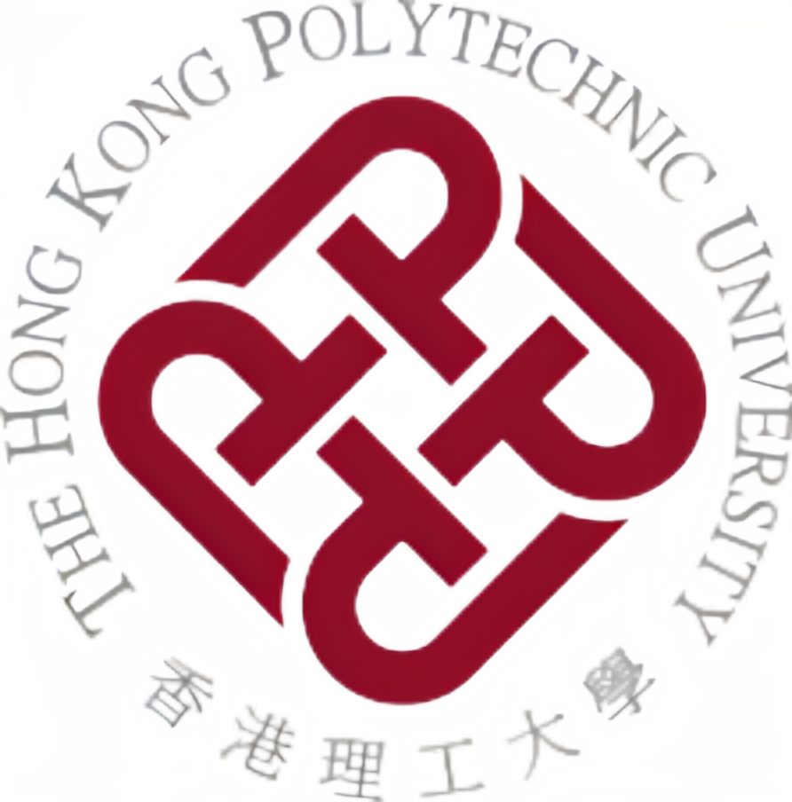
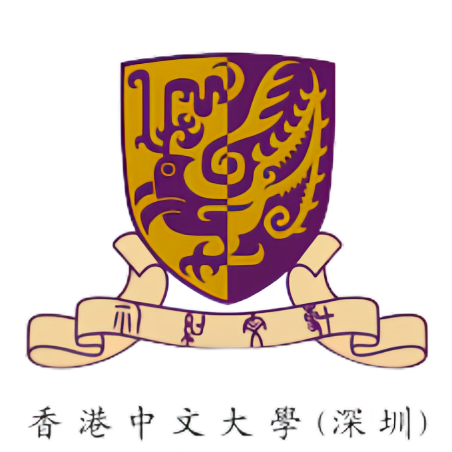
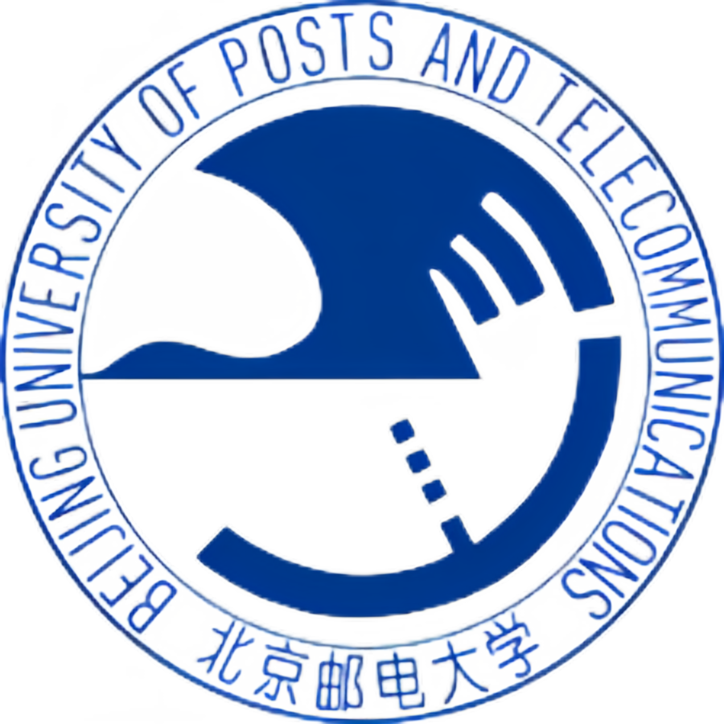
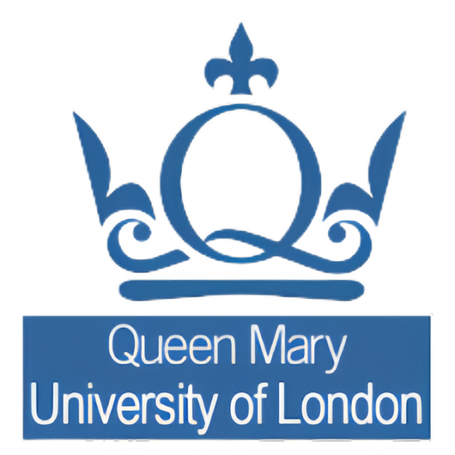

## Short Bio

Rongyu is a second-year dual Ph.D. candidate at Nanjing University and The Hong Kong Polytechnic University, where he is co-supervised by [Prof. Yuan Du](https://iscl.nju.edu.cn/42925/list.htm) and [Prof. Dan Wang](https://www4.comp.polyu.edu.hk/~csdwang/). He is now a visiting student at Peking University under the supervision of [Prof. Shanghang Zhang](https://iscl.nju.edu.cn/42925/list.htm). Previously, he received the M.Phil. degree from The Chinese University of Hong Kong, Shenzhen, supervised by [Prof. Fangxin Wang](https://mypage.cuhk.edu.cn/academics/wangfangxin/). He has published more than 10 papers in top conference journals such as CVPR, AAAI, TMC, and TCSVT, etc, with more than 120 citations. He was recently selected for the **First** China Association for Science and Technology “**Young Elite Scientist Sponsorship Program (Ph.D.)**”, 2025-2027.

## Research Interests

My broad interests lie in **efficient** and **generalization** learning towards open-world **multimodal systems**, especially for applications of autonomous driving and robotics. Earlier, my work focused on **federated learning** and **neural video delivery**.

- **Efficient and Generalization:** network architecture, structure sparsification
- **Multimodal System:** cloud-end collaboration, transmission overhead

## Education
-  **Peking University**
  - (2024.01-Present) Visiting Ph.D. student at HMI lab
-  **Nanjing University** 
  - (2023.09-Present) Ph.D. in Electrical Science and Technology 
-  **The Hong Kong Polytechnic University**
  - (2023.09-Present) Ph.D. in Computing Science 
-  **The Chinese University of Hong Kong, Shenzhen**
  - (2021.09-2023.03) M.Phil. in Computer and Information Engineering
-  **University of California, Berkeley**
  - (2019.06-2019.08) Visiting student
-  **Beijing University of Posts and Telecommunications**
  - (2017.09-2021.06) B.Mang. in E-Commerce Engineering with Law
-  **Queen Mary University of London**
  - (2017.09-2021.06) B.Eng. in Electrical Engineering and Computer Sciences





## Employment
-  **ByteDance**
  - (2025.01-Present) Research Intern, supervised by [Dr. Ming Lu](https://www.shanghangzhang.com/) 
-  **Beijing Academy of Artificial Intelligence**
  - (2024.08-Present) Research Intern, supervised by [Prof. Shanghang Zhang](https://www.shanghangzhang.com/) 
-  **OPPO Research Institute** 
  - (2022.09-2023.03) Research Intern, supervised by [Dr. Yandong Guo](https://scholar.google.com/citations?user=fWDoWsQAAAAJ&hl=zh-CN) 
-  **LENOVO Research Institute**
  - (2020.11-2021.05) Research Intern, supervised by [Prof. Jiangtao Gong](https://scholar.google.com/citations?user=AktmI14AAAAJ&hl=zh-CN&oi=ao)








